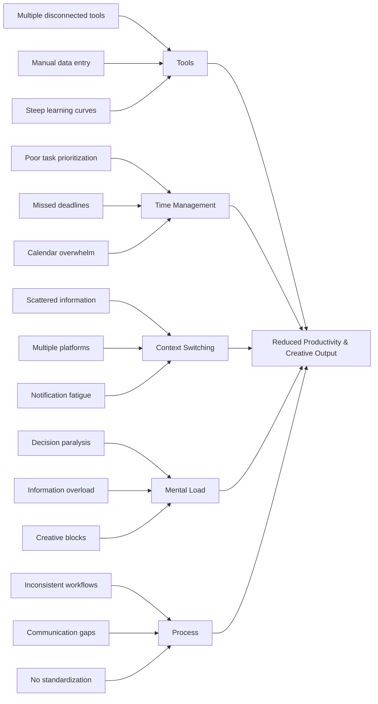

# Neema: Your AI Assistant for Independent Professionals

Neema is a helpful digital assistant made for people who work on their own - like business owners, content creators, and people running side businesses.

It works smoothly with the tools you already use, including Notion, Gmail, Google Calendar, LinkedIn, and Trello.

Neema helps you manage your daily work more easily, so you can spend more time on what's really important - growing your business and creating great content.

---

## Core Features

### 1. Task & Project Management

- Organize tasks across multiple projects
- Smart deadlines and reminders based on calendar context
- Daily stand-up and recap features

### 2. Smart Notes

- Bi-directional sync with Notion
- Summarization, tagging, and linking of notes using the LLM
- Voice-to-text capture and meeting transcription

### 3. Communication Management

- Gmail integration for email triage and smart replies
- Scheduling assistance via Google Calendar
- Auto-drafting LinkedIn responses and posts

### 4. Social Media Assistant

- Draft, schedule, and optimize LinkedIn posts
- Generate engagement metrics and suggestions
- Curated content feed based on interests and market

---

## Architecture Overview

- [x]  Frontend
- **Framework:** Responsive across devices
- **UI Library:** custom warm, friendly theme
- [x]  Backend
- **Database:** PostgreSQL for structured data, Redis for caching
- **Storage:** Firebase or Supabase for lightweight auth + cloud functions

### AI Layer

- **LLM:** Use OpenRouter with Mixtral or Claude Haiku for cheap, efficient reasoning
- **Hosting:** Run models via third-party APIs or deploy small local models using Ollama for advanced users

### Integrations

- **Notion API:** OAuth + SDK integration for real-time sync
- **Gmail & Calendar:** Google Workspace API (OAuth 2.0 flow)
- **LinkedIn:** LinkedIn Marketing Developer API for posting, messaging
- **Trello**:

---

## System Architecture

### Key Components

1. **Frontend App**
    - Mobile-first, responsive layout
    - Offline support for notes/tasks
2. **Backend Services**
    - User authentication and session management
    - Data sync with external APIs (Gmail, Notion, etc.)
    - Webhook listeners for real-time updates
3. **AI Middleware**
    - Request router for handling input to the LLM
    - Contextual prompt builder (injects tasks, schedule, recent emails)
    - Caching mechanism for frequent prompts to minimize cost
4. **Data Layer**
    - PostgreSQL for user data, preferences, and task storage
    - Realtime for push sync

---

## Build Plan

### Set-Up

- Set up repo structure and CI/CD
- OAuth setup for Google and Notion
- Build UI layout (Home, Inbox, Tasks, Calendar)

### Integrations

- Core integrations (Gmail fetch, Notion sync, Calendar sync)
- LLM prompt builder and response handler
- Add core logic for task creation and updates

### Connections

- Add LinkedIn content assistant
- Build onboarding flow and push notifications
- Implement caching and request optimization

### Launch

- Test full workflows
- Polish UI and add animations
- Deploy beta via TestFlight or Play Store Internal Testing

---

## Cost Optimization

- [ ]  Use OpenRouter or Together.ai to call low-cost models like Mixtral or Claude Haiku
- [ ]  Pre-cache frequent prompts and use heuristics to reduce unnecessary API calls
- [ ]  Offload recurring batch jobs (summarization, indexing) to scheduled cron tasks

---

## Next Steps

- [ ]  Design logo and branding kit for Neema
- [ ]  Build a web dashboard version for desktop use
- [ ]  Explore Chrome extension for LinkedIn/Gmail productivity overlay
- [ ]  Add speech command support for hands-free productivity

---

## Final Thoughts

Neema aims to be a reliable, friendly presence in the busy life of a startup founder or creator. With deep integrations, a helpful AI layer, and a thoughtful UX, Neema is designed to remove friction and bring flow to daily work.

---

*Built for builders, by builders.*

### Problem

### Root Problem Analysis

People who work alone - like business owners, content creators, and people with side businesses - face a common problem. They have to constantly switch between different work tools and juggle many tasks at once. This makes it harder for them to focus, be productive, and create their best work.

### Core Problem Statement

Professionals who work independently (like freelancers and business owners) spend up to 40% of their workday juggling different tools and switching between tasks instead of doing their actual work. This causes several problems:

- They create less because they're constantly being interrupted
- They miss important opportunities because they can't properly organize their tasks
- They get tired and stressed from managing too many tools and work processes
- They waste time trying to communicate across different platforms

### Solution Focus

Neema brings all your work tools together in one place. It uses AI to handle distracting background tasks, so you can focus on doing your best work without interruptions.

## Top 3 Priority Pain Points for MVP

### 1. Context Switching Overload

People lose time and focus when they have to keep switching between different work tools. Our first version will solve this by bringing the most important tools together in one simple place.

### 2. Task Management Problems

Business owners have their tasks spread across many different apps, which makes it hard to stay organized and meet deadlines. We'll create one central place to manage all tasks, with smart features to help prioritize what's most important.

### 3. Communication Overload

Keeping up with emails, calendar events, and professional networks takes too much time and effort. We'll make communication easier by helping users manage their emails better, handle their calendar, and stay connected on LinkedIn - all in one place.

<aside>
💡

<aside>
Starting with these three main problems helps us build a solid product that helps solo founders and creators with their biggest daily challenges. By focusing on these key issues first, we can give users helpful tools right away and make the product even better over time.

</aside>

</aside>